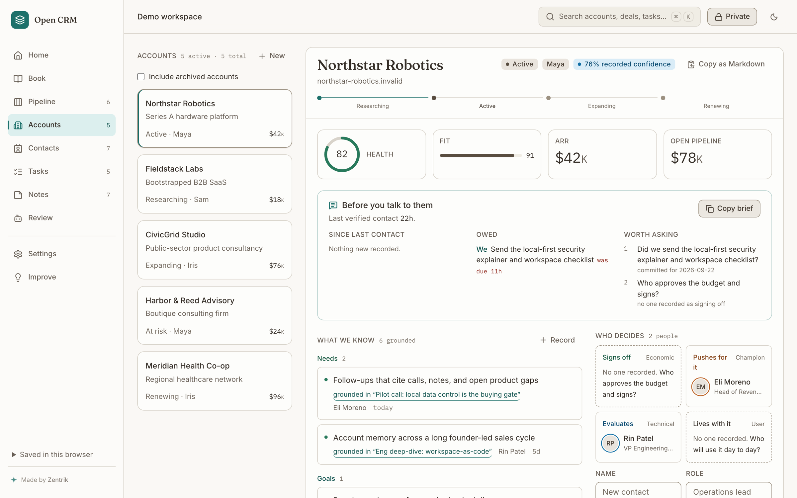

# Zentrik Open CRM



An open-source, local-first CRM for builders who want account work grounded in
real sources, not another place to manually maintain stale records.

[Product Intent](./docs/product-intent.md) ·
[First Use](./docs/first-use.md) ·
[Feedback And Support](./docs/feedback-and-support.md) ·
[Roadmap](./docs/roadmap.md) ·
[Brand Archetype](./docs/brand-archetype.md) ·
[Licensing And IP](./docs/licensing-and-ip.md) ·
[Self-Hosting](./docs/self-hosting.md) ·
[Contributing](./CONTRIBUTING.md)

Zentrik Open CRM is built for founders, consultants, agencies, small B2B teams,
and technical operators who sell, support, and build close to their users. It is
useful as a CRM on day one, and it also shows a larger product loop: users
submit feedback, signals become product evidence, agents prepare work, humans
review decisions, and releases are checked against outcomes.

## Why Open CRM

Most lightweight CRMs are easy to start but weak at remembering why an account
matters. Most powerful CRMs become expensive administration systems. Open CRM is
the middle path for small technical teams:

- account memory stays tied to calls, emails, support notes, reviews, usage,
  GitHub, and market signals
- next actions show the source that caused the recommendation
- Codex and similar agents get an explicit, privacy-aware operating surface
- the product can run locally, self-hosted, or eventually through Open CRM Cloud
- users can shape the product through the public Open CRM Buildroom loop

## Product Surface

- Today board for accounts, risks, next actions, and recent evidence
- Account creation, contacts, and account detail views
- Manual signal capture and signal inbox
- Open CRM Loop for ideas, evidence, agent work, releases, and outcome checks
- Codex task queue with copyable prompts and guardrails
- Settings, public-safe mode, export, and demo reset controls

## First Useful Workflow

1. Add or use a demo account.
2. Add or review the account's contacts.
3. Capture one real signal from a call, email, support thread, review, GitHub
   issue, usage note, or market observation.
4. Review the account detail page to see what changed.
5. Copy a Codex task when you want agent help drafting follow-up, researching an
   account, or shaping product feedback.
6. Use the Open CRM Loop to connect signals to ideas and release outcomes.

## Run Locally

```bash
npm install
npm run dev
```

The app will start at [http://127.0.0.1:5177](http://127.0.0.1:5177).

## Validate Changes

```bash
npm run typecheck
npm run build
npm run test:e2e
```

## Current Version

This first version is a Vite React app with local browser persistence. It
includes synthetic demo data only. It intentionally has no production API keys
or private customer records.

## Repository Guardrails

This repository is public-product code. Private operating data or customer data
must never enter this repo.

Read [Privacy Boundaries](./docs/privacy-boundaries.md) before importing data or
building integrations.

## License And Trademarks

Zentrik Open CRM is licensed under the
[Apache License 2.0](./LICENSE). Contributions intentionally submitted to this
repository are accepted under the same license unless stated otherwise before
inclusion.

Zentrik AI reserves its trademarks, product names, hosted services, private
APIs, private workspaces, product intelligence systems, runtime credentials, and
proprietary platform code. See [NOTICE](./NOTICE),
[Trademark Policy](./TRADEMARKS.md), and
[Licensing And IP](./docs/licensing-and-ip.md).

## Core Docs

- [Product Intent](./docs/product-intent.md)
- [Product Narrative](./docs/product-narrative.md)
- [Outward Ecosystem](./docs/outward-ecosystem.md)
- [Brand Archetype](./docs/brand-archetype.md)
- [First Use](./docs/first-use.md)
- [Self-Evolving Loop](./docs/self-evolving-loop.md)
- [Feedback And Support](./docs/feedback-and-support.md)
- [Release QA](./docs/release-qa.md)
- [Licensing And IP](./docs/licensing-and-ip.md)
- [Public Release Checklist](./docs/public-release-checklist.md)
- [Roadmap](./docs/roadmap.md)
- [Architecture](./docs/architecture.md)
- [Codex Operator Guide](./docs/codex-operator-guide.md)
- [Self-Hosting](./docs/self-hosting.md)
- [Privacy Boundaries](./docs/privacy-boundaries.md)
- [Public Brand Assets](./assets/brand/README.md)

## Public Portal

The first public feedback portal is **Open CRM Buildroom**. Its initial instance
manifest lives in [portal/open-crm-buildroom.instance.json](./portal/open-crm-buildroom.instance.json).

Open CRM Buildroom is where public-safe user requests, votes, release notes, and
outcome checks should make the product's evolution visible.

Use [Feedback And Support](./docs/feedback-and-support.md) to choose the right
channel: Tell Open CRM for contextual feedback, Buildroom for public requests
and votes, GitHub Issues for reproducible open-source work, support requests for
private help, and private vulnerability reporting for security issues.
