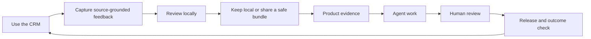

# Open CRM ecosystem

Open CRM has a local product surface and an optional product-feedback loop. The
local app, CLI, and MCP server are useful without a hosted service.

## Local product

The repository owns:

- accounts, contacts, pipeline, tasks, notes, and next actions
- local browser storage and folder workspaces
- synthetic fixtures and portable exports
- the CLI and MCP handoff for coding agents
- reviewable proposals and public-safe feedback bundles

Users can start with demo data, create an empty workspace, or connect a folder.
The product does not require an account with a hosted service for first value.

## Optional Zentrik connection

Zentrik can receive a reviewed, public-safe feedback bundle through a separate
maintainer-operated adapter. The adapter runs outside the browser, uses explicit
configuration, and does not send CRM records, credentials, or private notes.
It creates product evidence only after a person has inspected the content and
destination.

The connection is intentionally separate from account operations. A failed or
unavailable hosted service must not make local CRM work disappear or block an
export.

## Hosted feedback

Open CRM Buildroom is a planned hosted surface. Its manifest in
[`portal/`](../portal/) describes portable product ideas and public-safety
guardrails; it is not a live deployment. Link a hosted destination only after
verifying authentication, moderation, privacy, accessibility, failure states,
and support.

Until then, users can keep feedback local or prepare a GitHub issue manually.

## Public boundary

Never publish account records, private notes, credentials, raw transcripts, or
unreviewed customer evidence. A request or vote is evidence to evaluate, not a
roadmap promise. Human review remains visible before publication or any
customer-facing action.
