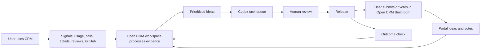

# Outward Ecosystem

Zentrik Open CRM should launch as a complete ecosystem, not only a repository.

The outward system has three surfaces:

1. **The CRM app**: the product users run locally, self-host, or use through
   Zentrik Open CRM Cloud.
2. **The product workspace**: the operating workspace where signal becomes
   insight, ideas, Codex tasks, releases, and outcome review.
3. **Open CRM Buildroom**: the public portal where users vote, request, and see
   public-safe product evolution.

## System Loop

The loop should be visible without exposing private CRM data. Public users see
safe summaries, idea status, votes, release notes, and outcome checks. The
workspace keeps account records, private transcripts, private emails, and
implementation detail out of the public surface.

The product intent is that the public should be able to see the product's brain
working: ideas being processed, agent work being prepared, validation waiting on
humans, releases moving forward, and outcome checks closing the loop.

## Required Workspace Entities

The first live instance should include:

- workspace: `Zentrik Open CRM`
- product: `Zentrik Open CRM`
- portal: `Open CRM Buildroom`
- portal alias: `open-crm`
- product allowlist: only `Zentrik Open CRM`
- account segments:
  - `Open CRM Community`
  - `Founder-Led Teams`
  - `Consultants and Agencies`
- idea taxonomy:
  - workflow area
  - user type
  - deployment path
  - evidence source
- visible starter ideas from the portal manifest
- moderation queue for new public submissions
- release/evolution log connected to shipped ideas
- agent work log showing public-safe context used, work prepared, and human
  review state
- outcome metrics for released ideas, including satisfaction and engagement
  checks where available

The source manifest lives at
[`portal/open-crm-buildroom.instance.json`](../portal/open-crm-buildroom.instance.json).

## Public Portal Defaults

- **Name**: Open CRM Buildroom
- **Alias**: `open-crm`
- **Expected host**: `https://open-crm.ideas.zentrik.ai`
- **Auth**: magic link for V1
- **Feedback mode**: simple vote for V1
- **New submissions**: hidden until review
- **First product**: Zentrik Open CRM only

Simple voting is the right V1 default because the first public surface should be
low-friction. Ranking can be added later for structured customer councils or
high-signal contributor cohorts.

## What The Public Should Understand

Every public surface should make these points obvious:

- This is a real CRM users can run.
- Users can shape what it becomes.
- Zentrik processes requests, usage, and feedback into product evidence.
- Agents can help turn evidence into work.
- Humans approve important decisions.
- Releases are evaluated against actual outcomes.
- The product does not hide the work: users can see what is being considered,
  what is waiting for validation, and what changed because of their input.

## First Value Path

The CRM should not require a user to connect private systems before they feel
value. The first public path should support:

- a synthetic demo workspace
- manual signal capture
- spreadsheet import
- public market and review research
- GitHub/community feedback
- Codex prompts that operate on local workspace context
- local feedback-bundle export for users who are not connected to hosted
  services yet

Private connectors can deepen the product later, but the first experience should
show the loop without asking for trust too early.

## Moderation And Privacy

The Buildroom must never expose private records. Public submissions should be
reviewed before visibility because users may paste private account context,
credentials, or confidential business detail.

When converting portal submissions into public ideas:

- summarize instead of quoting sensitive material
- remove customer names unless the submitter explicitly intended public mention
- keep private evidence in the private workspace
- publish the problem, affected workflow, proposed direction, and status

When showing agent work:

- show public-safe context references, not raw private content
- show a compact "what was used" trail while work runs
- keep a collapsed audit log after completion
- make human review state visible before any customer-facing action

## Launch Readiness

The ecosystem is ready for first public use when:

- the repository can be installed locally from a clean checkout
- the starter CRM app has synthetic demo data and no private records
- the public Buildroom exists from the manifest
- new submissions enter a review state
- accepted submissions create or link to ideas
- votes are visible and tied to account/user identity
- local/self-hosted feedback can be exported as `open-crm-feedback.v1`
- release notes can point back to public-safe evidence
- Codex has a documented operating contract
- agent work and human review are visible enough that the product feels
  self-evolving, not mysteriously automated
